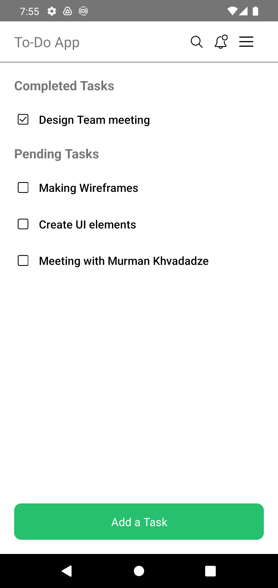
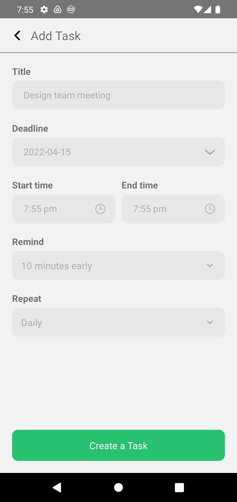
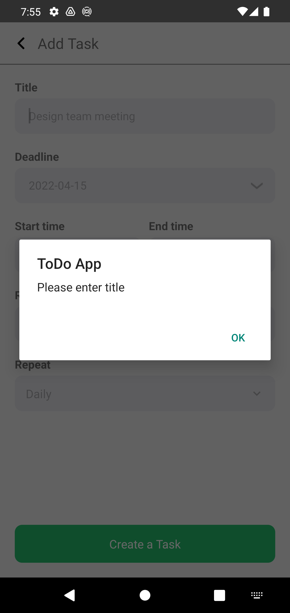

# Todo App

Simple React Native Todo App
<hr />
A user may add to the to-do task list, and view pending and completed tasks they have to complete, if the task is completed then it will show as a completed task list. if the task is not completed then it will show as a pending task list. user can be added to the check the checkbox then the task is completed task list and the user can be unchecked checkbox then there is a pending task list.
<hr />
<h1>Todo's app Preview</h1>

<div align="center">Android</div>
 <div align="center">
    
                                    
    
</div>
<div align="center">Ipnone 11</div>
 <div align="center">
    
                                    
</div>                                                                                                    
<div align="center">Ipad</div>
 <div align="center">
    
    
    
</div>                                                                                                

https://user-images.githubusercontent.com/103695916/163593280-b87ef027-cf73-432f-a165-fb8ee5fa410e.mov

https://user-images.githubusercontent.com/103695916/163593270-74e04142-2b5c-42f5-bc75-063f5848bfd5.mov

<hr />
<h3>Installation and Usage</h3>
<hr />

**Step 1:**

Download or clone this repo by using the below link:

```
git clone https://github.com/SagarMandani/TodoApp
```

**Step 2:**

Go to project root folder

```
cd todoapp
```

**Step 3:**

Execute the following command in console to get the required dependencies:

```
npm or yarn install
```

**Step 4:**

Make sure you have an ios Simulator or Android Emulator running or have an ios device with you:

```
npm or yarn start
```

* Android

yarn android to run the Android application (remember to start a simulator or connect an Android phone)

```
npx react-native run-android
```

* IOS

```cd ios -> pod install to install pod dependencies -> cd ..
```

yarn ios to run the iOS application (remember to start a simulator or connect an iPhone phone)

```
npx react-native run-ios
```

* About the Project

React Native To Do application created for learning purposes.

You can add tasks, get pending and completed tasks them, and mark as done.

Built With

- Make sure you have Install [react-sweet-state](https://atlassian.github.io/react-sweet-state/#/) - state management(sweet-state is heavily inspired by Redux mixed with Context API concepts)

```
- React Native
- react-sweet-state
- Dropdown
- React Navigation
- Datetimepicker
- prop-types
- styled-components
- moment
```
